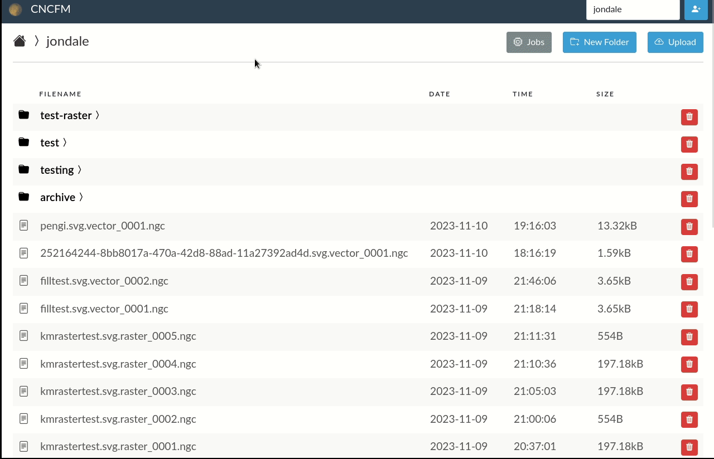

# cncfm

CNCFM is a web file manager with uploader and viewer plugins to help with CNC equipment. It was designed to give multiple users their own directory for storage somewhere accessible by the cnc machine (or the machine that runs it). This allows it to be used in a shared space by many users (such as a makerspace).

# plugins

There are two type of plugins, upload and view. Each type are associated with file types in the conifguration file.

**direct**  
An upload plugin that does no conversion on the file and simply uploads it as it is. This is useful

**svg2laser**  
An upload plugin that converts svg files into gcode that can be run by laser. There are some default configurations that support lasers that use M68 codes for laser power such as [bjj/2x_laser](https://github.com/bjj/2x_laser) and those that use spindle speed (S) for laser power such as grbl. These settings are pretty configurable in the config file though so it should support most setups with some tweaking.

**gcode2D**  
A viewer plugin to view gcode. It offers an editor to rename, edit, and/or save the gcode as well as a 2D view of it.

## Installation

The backend code is a mixture of php and python adopted from multiple projects. PHP serves up the user-facing side of the app from the www directory. The sentinels directory holds a few shell scripts that are meant to be run by cron to process jobs and file changes.

There is a very opinionated installation script in the scripts directory that will install cncfm. It assumes (and is only tested on) Debian and being the only service ran. The intention was to be installed on a vm/container to run the app.

## Configure

All configuration is driven off of the config.json file in the main directory. There are a few example files as a starting point. The install script will ask you which one you want to start with and then copy it to the correct location.

## Use

Using one of the default configs associates the svg file type with the svg2laser upload plugin. Uploading a file that is an svg will trigger the configuration options and then submit a job to be processed by that plugin.

---

 

The default configurations also have ngc files associated with the gcode2D viewer plugin. Clicking on an ngc file will trigger the plugin to view and in this case edit the gcode.
