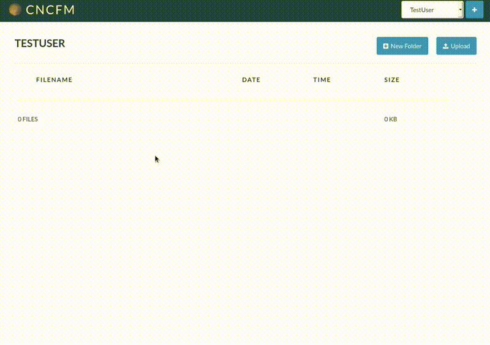
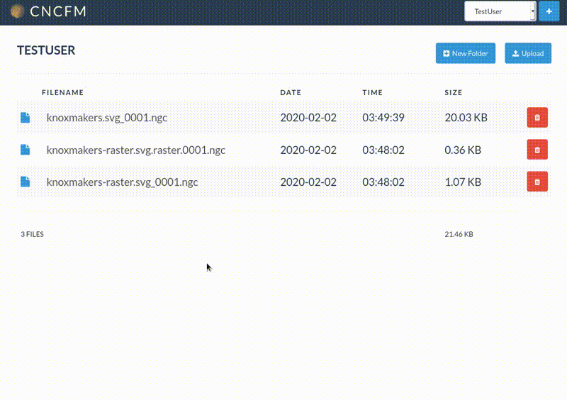

# cncfm
This is a the web interface we load onto our LinuxCNC controlled laser.  It was built to be modular and expandable to other cnc uses but currently the viewers and uploaders defined are specific to that setup.

## Installation

This is a very simple php web app.  You will need a webserver (like Apache or Nginx) set up to serve php.  Put the files in a directory that webserver serves and then edit the config file to match your setup.

## Capabilities

By default, you can directly upload files with an ngc extension.  This can be configured to be any file extension in the config file.

Image files (jpg, gif, png) files will trigger the raster-laser-ngc uploader.  This will save the file and create a ngc file to raster engrave the image.  This probably will work with other bitmap extensions and can be configured in the config file.

Svg files will trigger the svg-laser-ngc uploader.  This will give you a popup modal asking you for laser settings based on the stroke color of the paths in your svg.  You will be able to define passes based on each color it detects.  With each pass you can choose a preset value (if defined in the config file) or set custom feedrate and power settings.  If you have embedded a bitmap image into your svg then you will be offered raster settings as well and a separate ngc file will be created for just the raster engraving. 

Other than the direct upload, these capabilities currently assume a LinuxCNC setup based on [bjj/2x_laser](https://github.com/bjj/2x_laser) such as our [Moonraker](https://github.com/KnoxMakers/Moonraker).

## Use

Uploading an svg, choosing a preset for 3mm wood, setting light blue to preset engrave, black to preset cut, then creating the gcode file.

---

Uploading an svg with an embedded bitmap image and a vector line to cut it out.  You can see that it creates two files: one for the raster engraving and one for the vector cutting.

---

Clicking on an ngc file allows you to see and edit the gcode as well as visually see the paths that are defined.  This is great for quickly seeing and fixing issues before going to the machine.

## Thanks

Much of the code here has originated or is based on several open source projects that we would like to thank.

[Inkscape](https://inkscape.org/)

[gcodetools](https://github.com/cnc-club/gcodetools)

[Evil Mad Scientist Laboratories](https://github.com/evil-mad)

[bjj/2x_laser](https://github.com/bjj/2x_laser)

[Bootstrap](https://getbootstrap.com/)

[CodeMirror](https://codemirror.net/)

[Font Awesome](https://fontawesome.com/)

[jQuery](https://jquery.com/)

A multitude of others.
